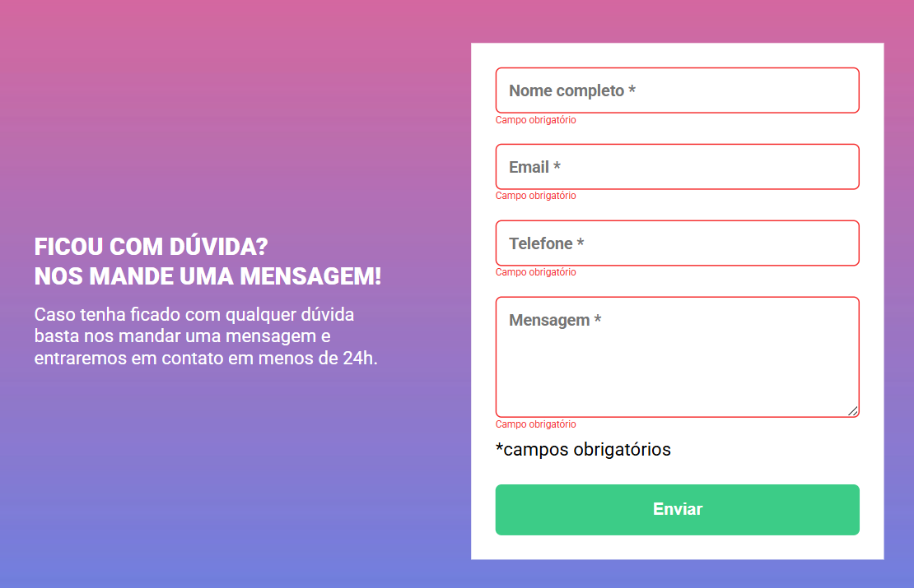

# 🚀 DevQuest — HTML + CSS + JS Intermediário
## Desafio: Formulário com Validação (Vanilla JS)

Este repositório contém minha solução para o desafio **“Formulário com validação”**, proposto no curso **DevQuest**.  
O objetivo é praticar **HTML e CSS avançados** e **JavaScript intermediário** criando um formulário acessível, responsivo e validado no front-end **sem bibliotecas**.

---

## 📑 Sumário

- [Preview](#-preview)
- [Especificação do desafio](#-especificação-do-desafio)
- [Tecnologias](#-tecnologias)

---

## 👀 Preview

---

## 📌 Especificação do desafio
- Implementar **validação de formulário com JavaScript puro** (sem libs).
- Ao **tentar enviar** o formulário:
  - Campos obrigatórios **não preenchidos** devem ganhar **borda vermelha**;
  - Deve aparecer uma mensagem **“campo obrigatório”** **logo abaixo** do campo inválido;
- **Fundo do formulário** deve utilizar a **imagem** disponibilizada na aula;
- O layout de referência está no **Figma**:  
  ➜ https://www.figma.com/file/zBKnYG9UNdUiIr8ClQTWSG/?node-id=3%3A2

---

## 🛠 Tecnologias
- **HTML5** (semântico)
- **CSS3** (responsivo; uso de variáveis e estados)
- **JavaScript (Vanilla JS)** para validação

---