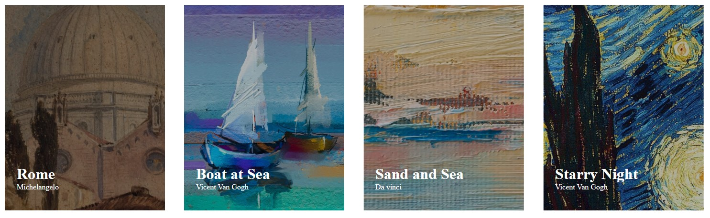
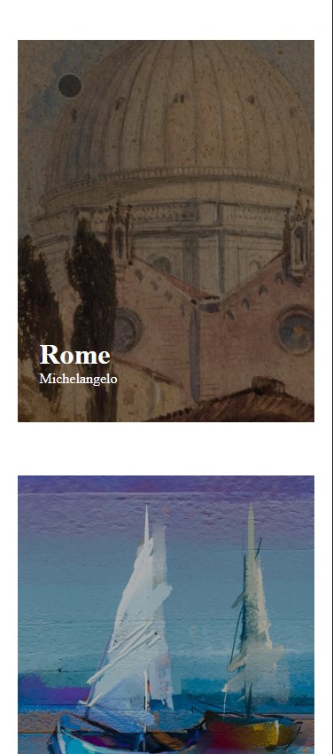

# Exercícios CSS Avançado Flexbox - Resolução do exercício lista de imagens com flexbox

Esta é uma solução para o [exercício do Curso Dev Quest](https://www.figma.com/file/DYk9DZr6urB9MZ4iNt1a61/Desafio-HTML-%2B-CSS?node-id=3%3A36&t=utrkm6Ulknjcmm53-0).

## Índice

- [Visão geral](#visão-geral)
   - [O desafio](#o-desafio)
   - [Captura de tela](#captura-de-tela)
   - [Links](#links)
- [Meu processo](#meu-processo)
   - [Construído com](#construído-com)
- [Autor](#autor)

## Visão geral

### O desafio

- Construir o projeto de acordo com os designs fornecidos.

### Captura de tela

### Links

- URL da solução: [https://github.com/Maicaoxd/lista-de-imagens](https://github.com/Maicaoxd/lista-de-imagens)
- URL do site ao vivo: [https://maicaoxd.github.io/lista-de-imagens/](https://maicaoxd.github.io/lista-de-imagens/)

## Meu processo

### Construído com

- Marcação HTML5 semântica
- Propriedades personalizadas CSS3
- Flexbox
- Responsividade

## Autor

- GitHub - [Maicon Alves Guedes](https://github.com/Maicaoxd)
- Frontend Mentor - [@Maicaoxd](https://www.frontendmentor.io/profile/Maicaoxd)
